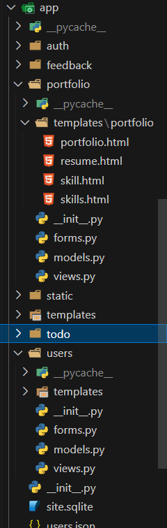
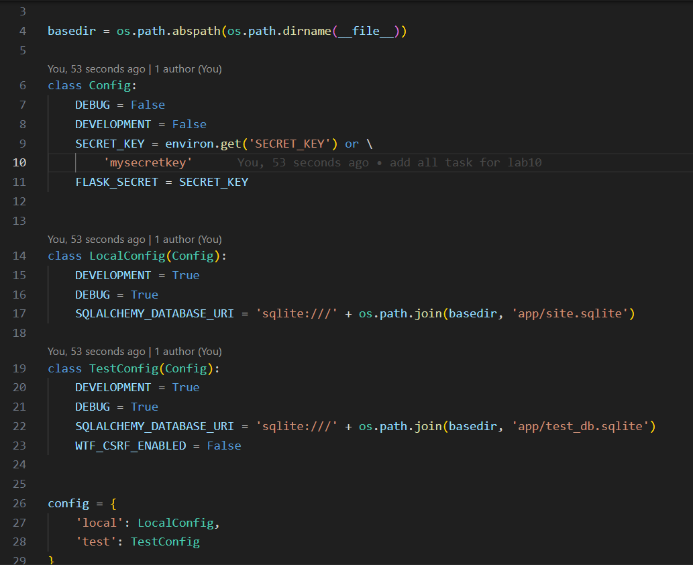

# Василь Вінтоняк ІПЗ-31

---

## Список лабораторних робіт:
10. [Лабораторна №10](#lab10) 

---

### Лабораторна №10
#### Завдання 1:
+ За допомогою blueprint-тів  здійнити рефакторинг коду проекту

#### Завдання 1:
+ Здійнити рефакторинг коду, використовуючи фабричний метод create_app  у файлі  __init__.py пакету app. Оновити файл соnfig, задавши класами різні конфігурації. Задати у  create_app  аргумент, що відповідає за конфігурацію.

#### Скріншоти:

__1. Рефекторинг проєкту здійснений за допомогою Blueprint__:

__2. Завдання 2__:

[Вверх](#anchor)