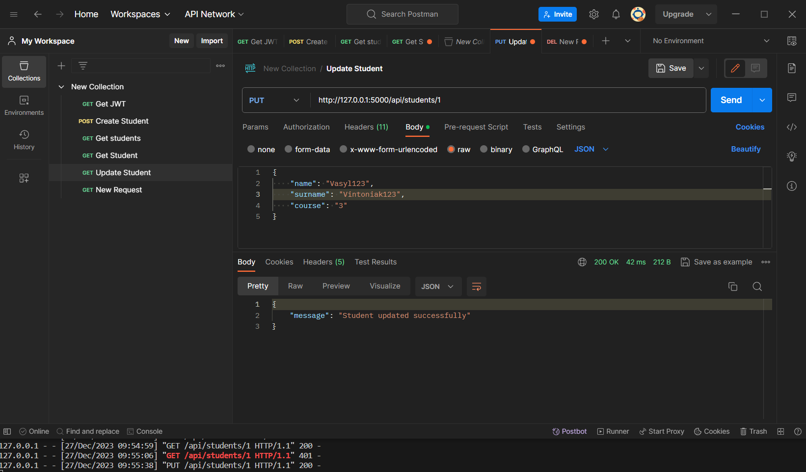

# Василь Вінтоняк ІПЗ-31

---

## Список лабораторних робіт:
10. [Лабораторна №10](#lab10) 
11. [Лабораторна №11](#lab11) 
12. [Лабораторна №12-1](#lab12-1) 
12. [Лабораторна №12-2](#lab12-2) 
13. [Лабораторна №13](#lab13) 
14. [Лабораторна №14](#lab14) 
0. [Самостійно робота №2](#ind2) 
15. [Лабораторна №15](#lab15) 

---

### Лабораторна №10

#### Завдання 1:
+ Здійнити рефакторинг коду, використовуючи фабричний метод create_app  у файлі  __init__.py пакету app. Оновити файл соnfig, задавши класами різні конфігурації. Задати у  create_app  аргумент, що відповідає за конфігурацію.

#### Скріншоти:

__1. Рефекторинг проєкту здійснений за допомогою Blueprint__:

__2. Завдання 2__:

[Вверх](#anchor)

---

### Лабораторна №11 

#### Завдання 1:
+ Написати CRUD модель для POST, Створити category(не зроблено), зробити пагінацію постів і модальне вікно видалення.

#### Скріншоти:

__1. Posts__:

__2. Add Post__:

__3. View Post__:

__4. Modal window for deleting__:

[Вверх](#anchor)

---

### Лабораторна №12 Частина 1

#### Завдання 1:
+ Написати тести для відображення головної сторінки та інших сторінок portfolio сайту(Views Tests), перевірка коректного завантаження сторінок реєстрації та входу (Views Tests), перевірка операцій СRUD моделі Todo (із використанням тестового клієнта)

#### Скріншоти:

__1. Структура тестів__:

__2. Скріншот з успішним проходженням тестів__:

[Вверх](#anchor)

---

### Лабораторна №12 Частина 2

#### Завдання 1:
+ Створіть тести в окремій папці за допомогою pytest для перевірки роботи блюпринту з постами, які мають включати різні сценарії, зокрема,  перевірка функціональності кожного маршруту,  можливі помилки та перевірка операцій CRUD  та взаємодії з БД для моделі Post із використанням тестового клієнта. Використайте  fixtures при створенні тестів.

#### Скріншоти:

__1. Скріншот з успішним проходженням тестів__:

[Вверх](#anchor)

---

### Лабораторна №13
#### Завдання 1:
+ Розробити RESTful API CRUD для існуючої моделі "Todo" окремим блюпринтом  у проекті з префіксом "api" (без використання допоміжних модулів для створення API). Мають бути доступні еndpoint-ти API: GET, POST, GET_ID, PUT, DELETE

#### Скріншоти:

__1. GET - all todos__:

__2. POST__:

__3. GET - by id todo__:

__4. PUT__:

__5. DELETE__:

[Вверх](#anchor)

---

### Лабораторна №14
#### Завдання 1:
+ Використати Basic Auth (модуль Flask-HTTPAuth) для реалізації отримання access  jwt-токена тільки для зареєстрованого користувача на сайті. 
+ Розмежуйте доступ до операцій Сreate, Update, Delete для моделі Todo ( доступ до цих операцій тільки по валідному jwt-токену).
+ Обробити всі можливі ситуації при виконанні запитів.

#### Скріншоти:

__1. GET JWT token__:

__2. POST with JWT token__:

__3. GET - get all with JWT token__:

__4. Error get without authorization__:

[Вверх](#anchor)

---

### Самостійно робота №2
#### Варіант 5 (Студенти)
#### Завдання 1:
+ Створіть RESTful API окремим блюпринтом у вашому проекті з базовими операціями CRUD (створення, читання, оновлення і видалення) для об`єктів моделі у обраній предметній області згідно варіанту (поля моделі придумайте самі, має бути принаймні 3 поля, крім id). Приділіть увагу валідації вхідних даних та обробку помилок, що можуть виникнути під час запиту.
+ Розширте попередній пункт, зокрема, подбайте про безпеку виконання операції оновлення і видалення, використовуючи доступ по валідному токену JWT. Зареєстровані користувачі можуть отримати токен.

#### Скріншоти:

__1. POST__:

__2. GET - All students__:

__3. GET - one student without authorization__:

__4. UPDATE__:

__5. DELETE__:

[Вверх](#anchor)

---

### Лабораторна №15
#### Завдання 1:
+ Використати модуль flask_restful для розробки відповідних ендпоінтів  get, post, put, delete. Рекомендується використати  marshmallow/flask_marshmallow для серіалізації  даних у json і десереалізації даних із http-запиту, зокрема і для валідації даних із запиту. Обробити помилки, які можуть виникати під час запитів.
+ Протестувати і заскрінити запити за допомогою Postman.
+ Прикрутити Swagger UI для документації даного API (окремим блюпринтом, використавши, наприклад модуль flask_swagger_ui). Описати.

#### Скріншоти:

__1. POST users__:

__2. GET all users__:

__3. GET user by id__:

__4. DELETE user__:

__5. SWAGGER.ui__:

__5. SWAGGER.ui get user by id__:

[Вверх](#anchor)
